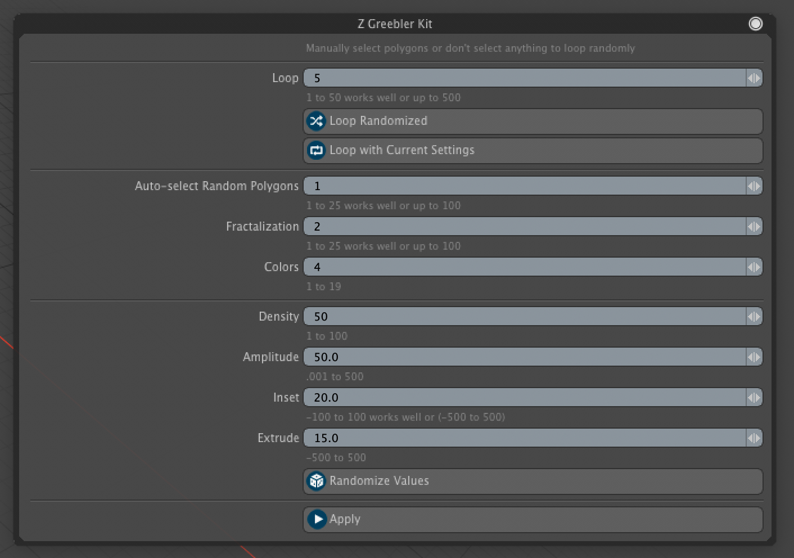
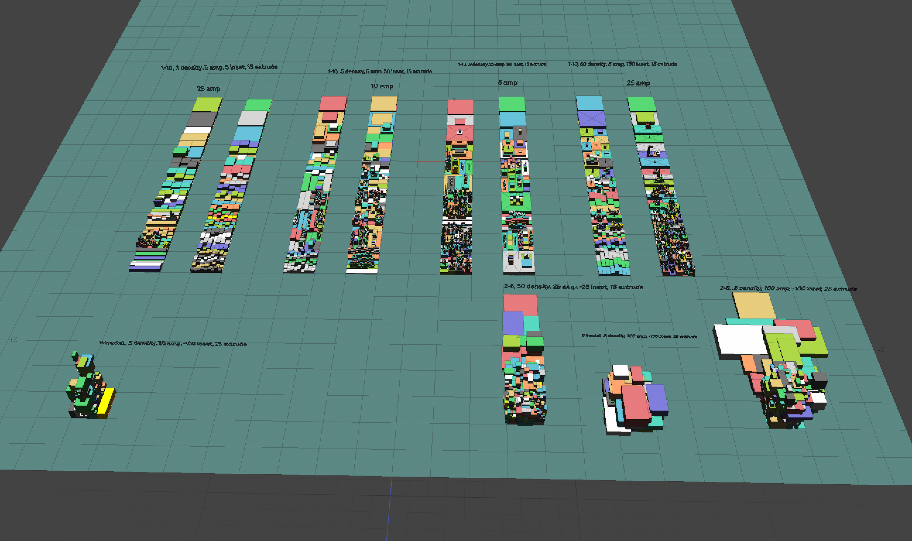

# Z-Greebler
Foundry Modo kit written in Python to auto generate greeble, nurnies, or surface details.

Copy the Z_Greebler folder to Luxology/Content/Kits. If you can't find your content folder open Modo and go to System/Open Content Folder. Restart Modo after adding kit.

